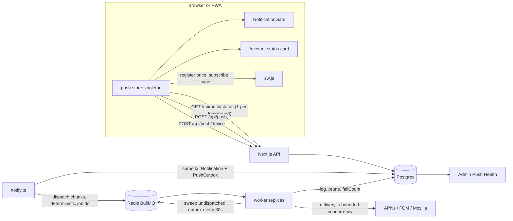

# Web Push — architecture, states, runbook

Web push (VAPID) delivers OS banners to desktop browsers, Android, and iOS
installed PWAs. Notifications are **mandatory**: a signed-in user whose device
cannot receive push is blocked by a full-screen gate until it can. This doc is
the map of how a push gets from `notifyAndPush()` to a phone, what state a
device can be in, and what to look at when someone says "I don't get
notifications".

Sized for ~1,000 users / ~50k pushes per day (0.6 push/s average, 100 push/s
design burst). `npm run test:push-load` proves one worker replica does >1,000
sends/s.

## Flow

## Server side

### 1. Create: transactional outbox (`src/lib/notify.ts`, `src/lib/push-queue.ts`)

`notifyAndPush()` / `createAndPublishNotifications()` write the `Notification`
rows **and** one `PushOutbox` row (`batchId`, `recipientIds`, `payload`) in the
same `prisma.$transaction`. A push is therefore never lost between "row
committed" and "job enqueued": if Redis is down, the outbox row simply stays
with `dispatchedAt = NULL`.

After commit, `dispatchOutbox(rows)` chunks recipients (50 per job,
`PUSH_JOB_CHUNK_SIZE`) and enqueues BullMQ jobs with
`jobId = ${batchId}:${chunk}`. BullMQ ignores a duplicate `jobId`, so
re-dispatching is idempotent. Job data is v2: `{ v: 2, batchId, chunk,
recipientIds, payload }`.

The web app's Redis client (`src/lib/redis.ts`) uses `enableOfflineQueue:
false` and a 5s connect timeout, so an enqueue against a dead Redis **fails
fast** instead of hanging a request.

### 2. Re-dispatch and retention

- **Worker sweep** (`worker.ts` → `sweepOutbox`, `src/lib/push/outbox-core.ts`):
  every `PUSH_OUTBOX_SWEEP_MS` (30s) one replica (Redis `SET NX` lock)
  re-dispatches up to 500 outbox rows older than 30s with `dispatchedAt IS
  NULL`, incrementing `attempts`.
- **Cron prune** (`/api/cron/deadline-reminders`): deletes dispatched rows older
  than 24h (`OUTBOX_RETENTION_MS`).

### 3. Deliver: `src/lib/push/delivery.ts` (the only sender)

The worker loads subscriptions for the job's recipients (skipping
`failCount >= 5`), computes unread badge counts, then:

- `deliverToSubscriptions()` sends with bounded concurrency
  (`PUSH_SEND_CONCURRENCY`, default 20) through `sendWithRetry` (3 attempts,
  500ms/2s backoff on 429/5xx/network) and returns **effects**, no DB writes.
- Outcome classification (`classifyOutcome` in `push-core.ts`):

  | Outcome | Status | Effect on `PushSubscription` |
  | --- | --- | --- |
  | `ok` | 2xx | `failCount = 0`, `lastSuccessAt = now` |
  | `gone` | 404, 410 | row deleted |
  | `permanent` | 400, 401, 403, 413 | `failCount++`, `lastFailureAt/Status`; deleted when it reaches 5 |
  | `transient` | 429, 5xx, network | logged only (already retried) |

- `applyDeliveryEffects()` writes one `createMany` of `PushDeliveryLog` rows
  per job plus a handful of batched `updateMany`/`deleteMany`.

Worker sizing: `PUSH_WORKER_CONCURRENCY` (10) jobs × `PUSH_SEND_CONCURRENCY`
(20) sends = 200 HTTPS requests in flight per replica. Two replicas run in
production; deterministic job ids keep them from double-sending. The worker
logs one metrics line per minute (`jobs, sends, ok, gone, permanent,
transient, p95`) and serves health JSON on `$PORT` (Railway health check).

Job shape v1 (`{ recipientIds, payload }`) is still accepted by
`parsePushJob` for one release; drop it after both services run the new code.

### 4. API (`src/app/api/push/*`)

All routes require a session; while an admin is impersonating, writes are
skipped with `{ ok: true, skipped: "impersonating" }` so the admin's phone
never gets registered under the user.

| Route | Purpose |
| --- | --- |
| `POST /api/push` | Register or rotate a subscription. Body `{ endpoint, keys, deviceId, platform, standalone, userAgent, oldEndpoint?, vapidKeyHash? }`. When `oldEndpoint` differs, the old row is deleted in the same transaction. Returns `{ ok, subscriptionId }`. Body capped at 8 KB. |
| `DELETE /api/push` | Remove one endpoint (used only by the service worker when `pushsubscriptionchange` cannot resubscribe). |
| `GET /api/push/status?endpoint=&deviceId=` | One round-trip: `{ registered, subscriptionId, failCount, vapidKeyHash, serverTime }`; also stamps `PushDevice.lastSeenAt`. |
| `POST /api/push/device` | Telemetry upsert of the device's client-side state (`PushDevice`). Validated and capped (`parseDeviceReport`), rate limited to 1 per 10s per device via Redis `SET NX EX` (allowed when Redis is down). |
| `GET /api/push?endpoint=` | Legacy status probe for clients on the previous bundle. Remove next release. |

### Data model (`prisma/schema.prisma`)

- `PushSubscription` — one per browser subscription. New: `platform`,
  `failCount`, `lastSuccessAt`, `lastFailureAt`, `lastFailureStatus`,
  `vapidKeyHash`. Index `(memberId, failCount)`.
- `PushDevice` — one per `(userId, deviceId)`, upserted, so it never grows
  unbounded. Holds what the **client** last reported: `platform`,
  `standalone`, `permission`, `supportReason`, `hasSubscription`,
  `registered`, `enabled`, `lastReason`, `lastDetail`, `userAgent`,
  `appBuild`, `lastSeenAt`, `lastEnabledAt`. This is the admin's view of every
  phone.
- `PushOutbox` — pending/ dispatched pushes: `batchId` (unique),
  `recipientIds`, `payload`, `attempts`, `createdAt`, `dispatchedAt`.
- `PushDeliveryLog` — one row per send attempt outcome (existing).

## Client side (`src/lib/push/`)

One runtime, one store. Nothing else touches `pushManager` or `/api/push`.

| Module | Role |
| --- | --- |
| `env.ts` | Synchronous browser probes: platform, standalone, permission, support, VAPID key, build id. |
| `support.ts` | Pure classification: platform detection, iOS non-Safari, permission → reason, sync response → reason, VAPID key compare/hash. |
| `state.ts` | Pure state machine: `derivePushView()`, `shouldGate()`, `shouldAttemptHeal()` (60s cooldown), and all user-facing guidance text. |
| `registration.ts` | Register `sw.js` once; `ready` with 8s timeout; **never unregisters a registration that holds a subscription**. |
| `subscription.ts` | `pushManager` I/O: read, subscribe (re-subscribe on VAPID key mismatch), `POST /api/push` with `oldEndpoint`, `GET /api/push/status`, permission request from a gesture. All calls have timeouts. |
| `telemetry.ts` | `POST /api/push/device`, throttled (10s min, same state at most every 5 min), `keepalive`. |
| `store.ts` | The singleton. Serializes every `pushManager`/fetch operation, caches the last result in `localStorage` for 5 min, refreshes at most every 3s and once per foreground, auto-heals once per 60s, exposes `usePushStore()`, `refreshPushStatus()`, `enablePushFromGesture()`, `startPushRuntime()`. |

`PushBootstrap` (renders nothing, mounted in `dashboard-shell.tsx` and
`client-shell.tsx`) calls `startPushRuntime()`. `NotificationGate`,
`NotificationSetup` (account page) and `NotificationDiagnostics` all render
from `derivePushView()`.

### Views (`PushView`)

| View | Meaning | Gated in production? |
| --- | --- | --- |
| `enabled` | permission granted, subscribed, server confirmed | no |
| `verifying` | granted; first check not finished | no |
| `repairing` | granted; store is (re)subscribing | no |
| `repair-failed` | automatic repair failed; shows the concrete reason + Retry | yes |
| `prompt` | permission `default`; show Enable | yes |
| `pre-prompt` | iOS PWA, permission `default`: explain the one-shot prompt, then Continue | yes |
| `denied` | blocked at OS/browser level; iOS shows two recovery paths | yes |
| `install` | iOS Safari tab: Add to Home Screen | yes |
| `safari-install` | iOS Chrome/Firefox tab: open in Safari, then install | yes |
| `unsupported` | no push and no install path | no |
| `impersonating` | admin viewing as user | no |

The gate is never shown because of a "checking" flag, and never while the
runtime is still working (`verifying`/`repairing`). In development
(`NODE_ENV !== "production"`) it is never shown.

### Service worker (`public/`)

- `sw.js` — entry. `push` (display via `sw-lib` decisions), `notificationclick`,
  `pushsubscriptionchange` (re-subscribes and `POST /api/push` with
  `oldEndpoint`; `DELETE /api/push` if it cannot). `importScripts` the other
  two. Carries the `// @BUILD_VERSION` stamp Railway rewrites at build so every
  deploy changes the file bytes and browsers pick up the update.
- `sw-cache.js` — install/activate + caching strategies (unchanged behaviour).
- `sw-lib.js` — pure, unit-tested decision logic (`shouldShowPushNotification`,
  `subscriptionChangeBody`, `classifyRequest`, …).

## Environment

| Variable | Where | Notes |
| --- | --- | --- |
| `NEXT_PUBLIC_VAPID_PUBLIC_KEY`, `VAPID_PRIVATE_KEY` | web + worker | Required. Rotating the public key makes every device re-subscribe automatically (key hash compared on each check). |
| `REDIS_URL` | web + worker | BullMQ queue, sweep lock, device-report rate limit. |
| `DATABASE_URL` | web + worker | Worker runs `prisma/migrate.mjs` on boot. |
| `NEXT_PUBLIC_APP_URL` | web + worker | Fallback click-through URL in payloads. |
| `PUSH_WORKER_CONCURRENCY` | worker | Jobs in parallel per replica. Default 10. |
| `PUSH_SEND_CONCURRENCY` | worker | Sends in flight per job. Default 20. |
| `PUSH_OUTBOX_SWEEP_MS` | worker | Outbox sweep interval. Default 30000. |
| `PUSH_WORKER_VERBOSE` | worker | Log every completed job. |
| `CRON_SECRET` | web | Authenticates the cron route that prunes the outbox and logs. |

## Rollout (zero downtime)

Ordering matters because the worker queries new columns and the web writes a
new table.

1. **Migrate.** `prisma/migrations/20260916170000_push_rewrite` is purely
   additive. Both services run `node prisma/migrate.mjs` on boot
   (`railway.toml` start command; `start-worker.sh`), and `migrate deploy`
   holds an advisory lock, so whichever boots first migrates and the other is
   a no-op.
2. **Deploy the worker.** It accepts v1 and v2 job shapes, so jobs already in
   Redis from the old web build still deliver.
3. **Deploy the web.** Starts writing `PushOutbox` + v2 jobs, ships the new
   `sw.js`. Existing devices pick up the new SW on next open; the old
   `GET /api/push?endpoint=` stays answerable for clients on the old bundle.
4. **Next release:** delete v1 parsing in `parsePushJob`, the legacy
   `GET /api/push`, and `enqueuePush` in `push-queue.ts` if nothing else calls it.

Rollback: redeploy the previous web/worker images. The new columns have
defaults and the new tables are ignored by old code; nothing needs to be
reverted in the database.

## Runbook

**"User X does not get notifications."**
Admin → Settings → Member Notifications → Push health. Click the user.

- No `PushDevice` row → they have not opened the new build. Ask them to open
  the app (installed icon on iOS).
- `permission = denied` → OS-level block. iOS: Settings → Notifications → Nizek
  → Allow, force-quit, reopen, tap **Check again**; or delete the icon and
  reinstall from **Safari**. Android/desktop: site settings → Notifications →
  Allow.
- `supportReason = needs-install` / `needs-safari-install` → iOS tab. Must
  install from Safari's Share → Add to Home Screen and open from the icon.
- `permission = granted`, `enabled = false`, `lastReason` set → automatic repair
  is failing; `lastDetail` has the concrete error (server status, `pushManager`
  error). `store.ts` retries once a minute on its own.
- `enabled = true` but no banners → look at the subscription rows: `failCount`
  and `lastFailureStatus` (403 on `web.push.apple.com` usually means the VAPID
  key changed and the device has not reopened the app yet; 410 rows are
  pruned automatically). Then the last 20 delivery logs, then send a test from
  the diagnostics card.

**"Nobody gets notifications."**

- Push health → queue: `reachable=false` means Redis is down; outbox rows
  accumulate (`undispatched` count, oldest age) and drain automatically when
  the worker's sweep can reach Redis again.
- Queue reachable, `waiting` growing, nothing completed → worker is down. Check
  the worker service logs / health endpoint; jobs are not lost.
- Worker metrics line shows `permanent` climbing across the fleet → VAPID keys
  mismatch between web and worker env. Fix env; devices re-subscribe on open.

**Verifying a deploy:** `npm test` (unit), `npm run test:e2e` (SW + gate in
Chromium/Firefox/WebKit), `npm run test:push-load` (throughput + effects).
Manual scenarios: `docs/push-qa-scenarios.md`.
